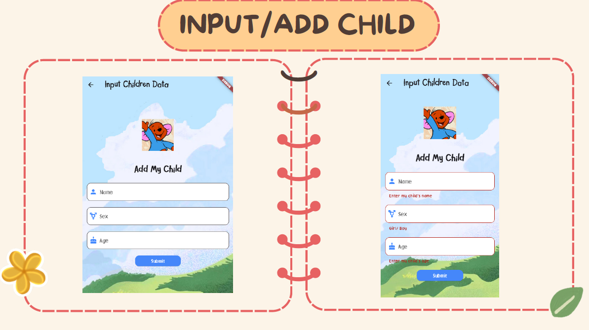

# Hundred Acre Woods Daycare


This Daycare Management App is a Flutter application designed to help parents and caregivers manage children's activities and records in a daycare setting. The app allows parents to add new children, view their children's activity reports, and caregivers to manage children and their activities.

## Features

- **Parents**:
  - View a list of their children.
  - Add a new child to the daycare.
  - View activity reports for each child.

- **Caregivers**:
  - View all children in the daycare.
  - Add, update, and modify activity reports for each child.

## Screenshots




## Getting Started

### Prerequisites

- Flutter SDK: [Flutter Installation](https://flutter.dev/docs/get-started/install)
- Dart SDK (comes with Flutter)
- A code editor like Visual Studio Code or Android Studio

### Installation

1. **Clone the repository:**
   ```sh
   git clone https://github.com/rosesarejade/PBM/tree/main/UAS%20PBM
   cd application-directory
   ```

2. **Install dependencies:**
   ```sh
   flutter pub get
   ```

3. **Run the app:**
   ```sh
   flutter run
   ```
   
## Main Project Structure

```
lib/
├── main.dart                # Entry point of the application
├── models/
│   ├── activity.dart        # Activity model
│   ├── child_data.dart      # Child model
├── providers/
│   └── database_helper.dart    # SQLite data service
├── screens/
│   ├── input_children.dart       # Screen to add a new child
│   ├── caregiver_home.dart  # Caregiver's home screen
│   ├── child_activities.dart # Screen to view and manage child's activities
│   ├── home_parent.dart     # Parent's home screen
│   ├── input_activity.dart  # Screen to input new activity data
```

## Usage

### Parent Interface

1. **Home Screen:**
   - View a list of your children.
   - Click the floating action button to add a new child.

2. **Add Child:**
   - Enter the child's name, age, and gender.
   - Submit to add the child to the daycare.

3. **View Activities:**
   - View a list of activities for each child.
   - Click on an child's name to see their activities detail report.

### Caregiver Interface

1. **Home Screen:**
   - View a list of all children in the daycare.
   - Click on a child's name to view and manage their activities.

2. **Manage Activities:**
   - View a list of activities for each child.
   - Click on the elevated edit button to update or modify it.
   - Add new activity details using the provided form.

## Data and Mockbin Server
For initial data management, this application is connected to a mock server to post and get the entered data.


Further development, build database using SQLite. The code is provided in the Providers folder, then run the application using a mobile emulator.

## Contributing

1. Fork the repository.
2. Create a new branch (`git checkout -b feature/your-feature-name`).
3. Make your changes.
4. Commit your changes (`git commit -m 'Add some feature'`).
5. Push to the branch (`git push origin feature/your-feature-name`).
6. Create a new Pull Request.

## License

This project is licensed under this License - see the ([LICENSE](https://github.com/rosesarejade/PBM?tab=GPL-3.0-1-ov-file#)) file for details.

## Acknowledgments
- Flutter Documentation
- Special thanks to my teammates: [davina](https://github.com/devvinry) and [chema](https://github.com/chemafau)
