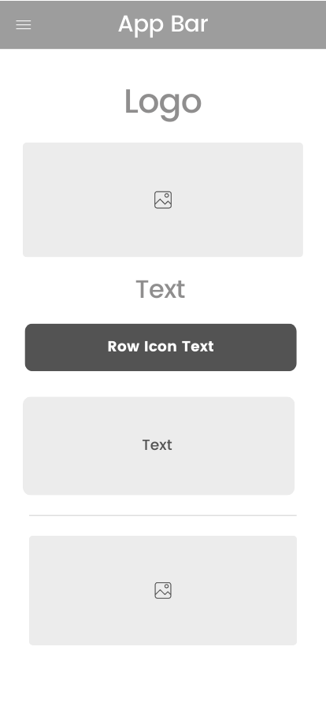
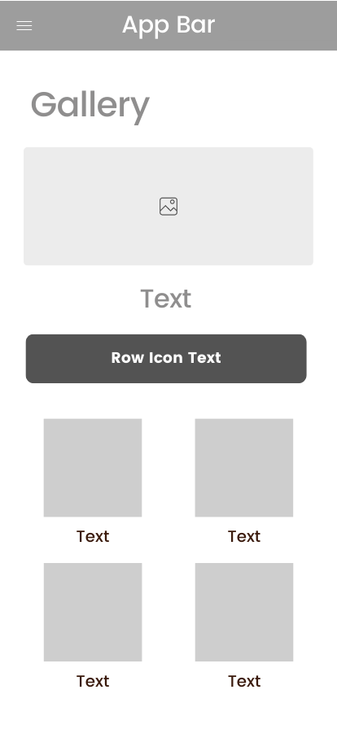
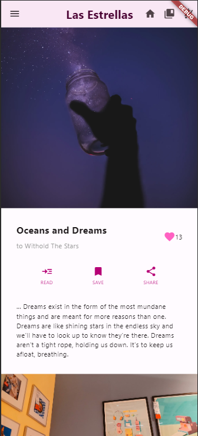
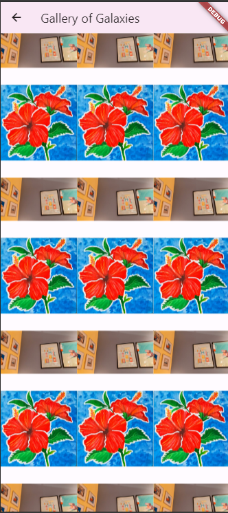

##### mini_project_01

## _STARLIGHT: Las Estrellas_
A simple personal blog mobile view

## Getting Started

This project is a starting point for a learning to develop Flutter application.

To get started take inspirations from related websites of choice, some of the references used in this project:
- [A recipe blog](https://bromabakery.com/)
- [An art shop](https://kennedywalsh.com/)

Analyze the elements into sections; such as buttons, rows, columns, etc. then wireframe the pages to code as follows
- the first page



- the second page



## The Project
in this documentation running the ```main.dart``` will show the main page:



and the Gallery view once the saved bookmark button on the top right is clicked:



## Credits/ Acknowledgements
Stories are from [the author's Medium](https://medium.com/@torry__Jr/to-withhold-the-stars-4afdcc293449) and pictures are from local.

## Development
This project will be further improved.


For help getting started with Flutter development, view the
[online documentation](https://docs.flutter.dev/), which offers tutorials,
samples, guidance on mobile development, and a full API reference.

- [Lab: Write your first Flutter app](https://docs.flutter.dev/get-started/codelab)
- [Cookbook: Useful Flutter samples](https://docs.flutter.dev/cookbook)